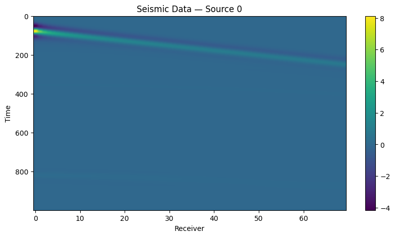
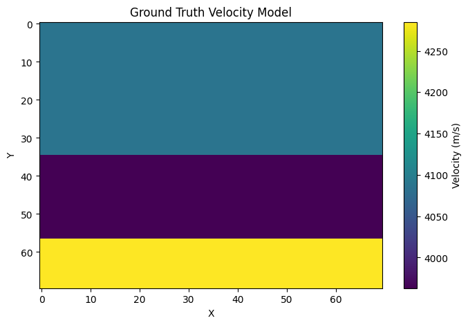
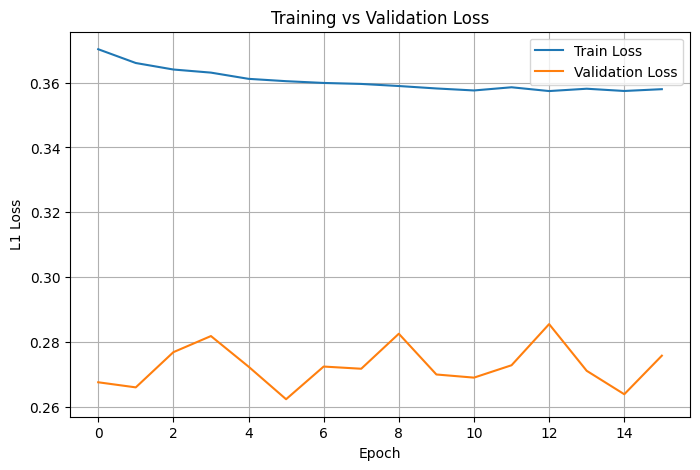
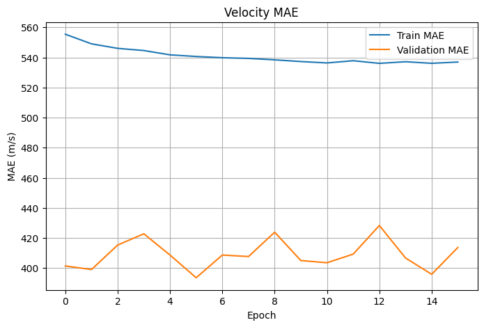
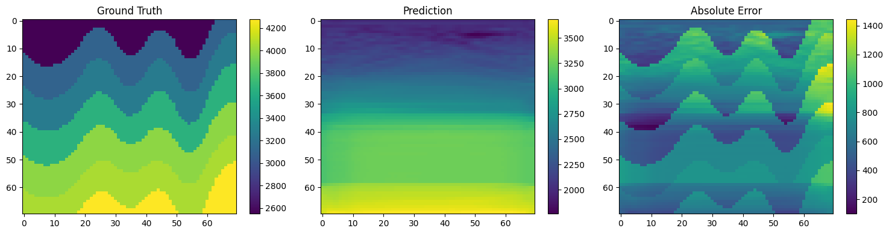

# Geophysical Waveform Inversion (Yale/UNC-CH — Kaggle)

A PyTorch baseline for the [Yale/UNC-CH Geophysical Waveform Inversion](https://www.kaggle.com/competitions/waveform-inversion) Kaggle competition: predicting subsurface velocity maps from simulated seismic waveform recordings using a CNN encoder-decoder.

## Problem

Given seismic waveforms recorded from multiple sources/receivers over time, predict the 2D subsurface velocity map that produced them (full-waveform inversion, framed as supervised image-to-image regression).

- **Input:** seismic data, shape `(5, 1000, 70)` — 5 sources × 1000 timesteps × 70 receivers
- **Output:** velocity map, shape `(1, 70, 70)`, in the range **1500–4500 m/s**

| Seismic input (one source) | Ground truth velocity map |
|---|---|
|  |  |

## Data

Sourced via `kagglehub.competition_download('waveform-inversion')`. The competition's own download only includes a small prototyping subset (`train_samples/`) — the full ~670GB training set (derived from [OpenFWI](https://openfwi-lanl.github.io/)) has to be added separately as additional Kaggle Datasets and is **not** used in this baseline run.

| | Count |
|---|---|
| Training file pairs (`train_samples`) | 12 (500 samples each) |
| Geology families | `vel` (8 files), `style` (4 files) |
| Train / validation split | 5000 / 1000 samples (10% held out, stratified by family) |

Each `.npy` file pair contains 500 `(seismic, velocity)` samples. Seismic amplitudes are normalized by a global scale factor computed from a percentile of the training data; velocity maps are normalized to `[-1, 1]` before training and denormalized back to m/s for evaluation.

## Model

`InversionNet` — a small CNN encoder-decoder (~3.35M parameters):

- 4-stage strided-convolution encoder (32 → 64 → 128 → 256 channels)
- Bottleneck convolution block
- Decoder: bilinear upsampling + skip-connection concatenation + convolution, mirroring the encoder back down to 32 channels
- Final conv head + `tanh`, output scaled to the velocity range

```
Total parameters: 3,351,105
```

## Training

| Hyperparameter | Value |
|---|---|
| Batch size | 32 |
| Optimizer | AdamW |
| Learning rate | 3e-4, cosine annealing |
| Loss | MAE (L1) |
| Mixed precision | enabled (AMP) |
| Early stopping | on validation MAE |
| Best validation MAE | ~393.6 m/s (≈13% relative error on the 3000 m/s velocity range) |

### Results

| Training / validation loss | Validation MAE |
|---|---|
|  |  |

Loss and MAE plateau early — a direct consequence of training on only 12 files (see [Limitations](#limitations) below).

### Sample prediction



The model recovers the broad depth trend in velocity (deeper = faster) but blurs out the finer curved fault/layer structure the ground truth actually has — again consistent with a severely undersized training set.

## Inference / Submission

`submission.csv` is generated by running batched inference over every file in `test/`, matching each prediction back to the competition's `sample_submission.csv` format: every row (`y` position) is included, but only odd-indexed `x` columns are submitted, as specified by the competition.

## Repo Contents

```
.
├── waveform_inversion.ipynb   # end-to-end notebook: data → model → training → submission
├── requirements.txt
└── assets/                    # plots used in this README
```

## Setup

```bash
pip install -r requirements.txt
```

Run on a Kaggle Notebook with GPU enabled (simplest — `kagglehub` auth is automatic there), or any environment with a configured Kaggle API token.

## Limitations

- **Dataset size.** Training on 12 files (the Kaggle sample subset) rather than the full ~470k-sample OpenFWI-derived dataset is the single biggest bottleneck — it directly explains the flat loss curve and blurred predictions above.
- **Architecture assumption.** U-Net-style skip connections assume local spatial correspondence between input and output pixels. For FWI this doesn't strictly hold — a single velocity-map pixel influences the *entire* seismic trace via wave propagation, not a local patch of it. Worth benchmarking an encoder-only architecture (e.g. a small ViT with a linear regression head, no decoder) against this U-Net on the same data.

## Next Steps

- Swap in the full OpenFWI training data
- Benchmark a decoder-free ViT backbone against the current CNN
- Add horizontal-flip TTA and EMA weights
- Train per-family specialist models and ensemble, once the base model and dataset size are  solid

## Acknowledgements

Baseline architecture inspired by [InversionNet](https://arxiv.org/abs/1912.09292) (Wu & Lin, 2019). Competition hosted by Yale University and UNC-Chapel Hill on Kaggle.
